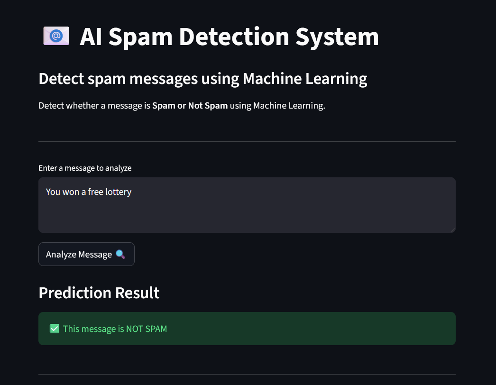
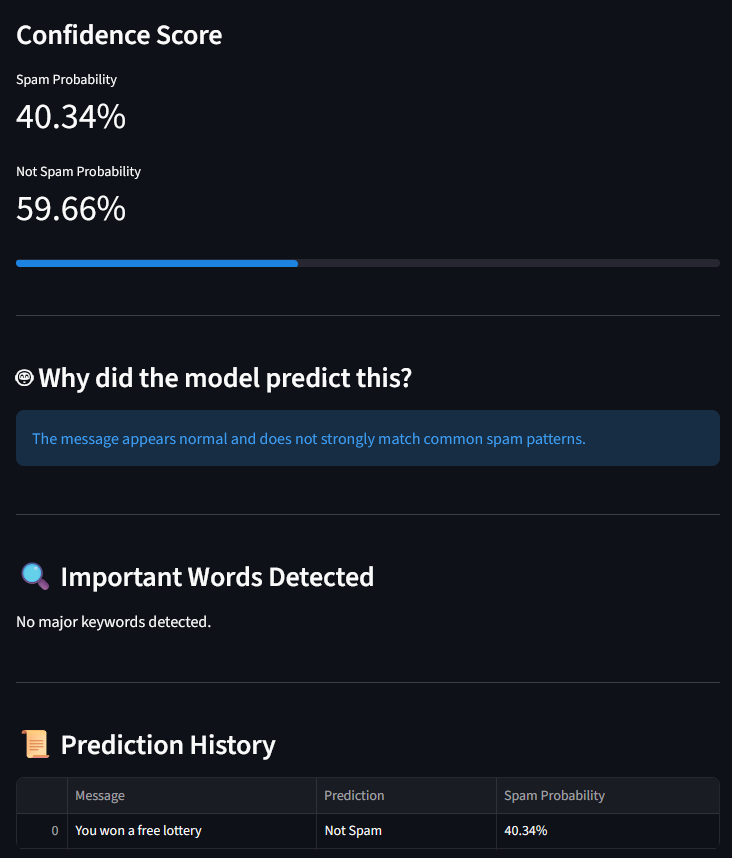

# AI Spam Detection Web App

This project is a Machine Learning web application that detects whether a message is Spam or Not Spam.

## Features
- Detects spam messages using NLP
- Shows probability score
- Interactive web UI

## Tech Stack
Python  
Scikit-learn  
TF-IDF Vectorization  
Naive Bayes Classifier  
Streamlit

## How to Run

Install dependencies:

pip install -r requirements.txt

Run the app:

streamlit run app.py

##  How to Run

### Backend
python -m uvicorn api:app --reload --port 8000

### Frontend
python -m streamlit run app.py

## 📸 Project Screenshot

